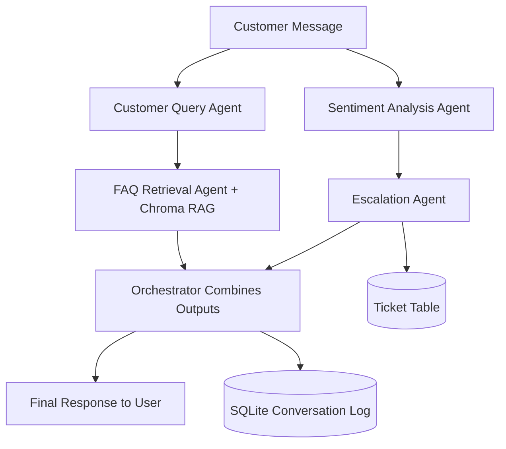

# Architecture Overview

## High-Level Components

1. UI Layer (Streamlit)
- Chat interface for customer-agent interaction.
- Dashboard panel for ticket monitoring.

2. Agent Orchestration Layer (LangChain-style agent workflow)
- AgentOrchestrator coordinates specialized agents.
- Agents collaborate in sequence to produce final output.

3. AI/LLM Layer
- Provider abstraction supports OpenAI, Gemini, and Ollama.
- Safe fallback mode for no-key demos.

4. Knowledge Layer (RAG)
- Chroma vector store stores embeddings from FAQ/TXT/PDF files.
- Similarity retrieval fetches relevant policy information.

5. Persistence Layer
- SQLite stores conversation history, metadata, and ticket states.

## Agent Workflow

1. Customer Query Agent identifies intent and urgency.
2. Sentiment Analysis Agent scores customer tone.
3. FAQ Retrieval Agent performs RAG and drafts response.
4. Escalation Agent decides if human handoff is needed.
5. Orchestrator saves interaction and returns final response.

## Mermaid Diagram

## Why This Looks Enterprise-Ready

- Multi-agent specialization instead of monolithic prompt calls.
- Provider-agnostic LLM integration with fallback mode.
- RAG-backed grounding from business documents.
- Auditability through trace and stored conversation metadata.
- Human-in-the-loop escalation simulation with ticketing.
